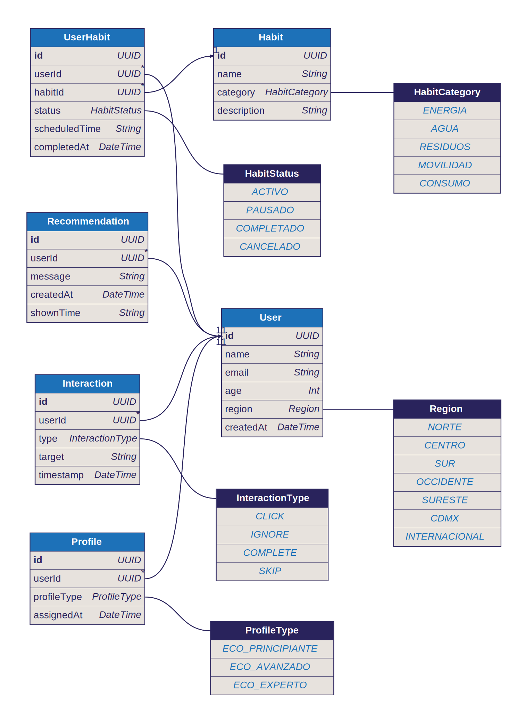

# Proyecto: **api-smart-hagbits**

Este documento detalla las convenciones y buenas prácticas para la gestión de ramas y la escritura de mensajes de commits en este proyecto.

---

## Convenciones para los commits

Usaremos un formato específico para los mensajes de commits con el objetivo de mantener claridad y consistencia en el historial del repositorio. A continuación se describen los principales tipos de commits:

### Tipos de commits:

- **`feat`**: Utiliza este tipo de commit para añadir una **nueva funcionalidad** al proyecto.

  - **Ejemplo**:
    ```
    feat: implement user registration API
    ```

- **`fix`**: Usa este tipo cuando hagas una **corrección de errores** en el código.

  - **Ejemplo**:
    ```
    fix: correct validation on login endpoint
    ```

- **`refactor`**: Indica un **cambio en el código** que **no añade nuevas funcionalidades ni corrige errores**. Se refiere principalmente a mejoras en la estructura o en la legibilidad del código.

  - **Ejemplo**:
    ```bash
    refactor: restructure user service for better readability
    ```

- **Otros posibles tipos** (si fuera necesario):
  - **`docs`**: Para cambios en la documentación.
  - **`style`**: Cambios que no afectan la lógica (formato, espacios, etc.).
  - **`chore`**: Actualización de tareas rutinarias, como dependencias.

---

## Convenciones para el nombre de ramas

Para mantener un flujo de trabajo organizado, el nombre de las ramas debe ser **descriptivo**, estar en **minúsculas** y usar **guiones (-)** para separar las palabras. Esto facilita la identificación del propósito de cada rama.

### Tipos de ramas:

1. **Ramas de características (`feature/`)**:

   - Usa esta convención cuando estés añadiendo una nueva funcionalidad.
   - **Ejemplo**:
     ```
     feature/user-authentication
     ```

2. **Ramas de corrección de errores (`bugfix/`)**:

   - Para correcciones de errores.
   - **Ejemplo**:
     ```
     bugfix/fix-api-routes
     ```

3. **Ramas de refactorización (`refactor/`)**:
   - Para cambios en la estructura o mejora del código sin añadir funcionalidad.
   - **Ejemplo**:
     ```
     refactor/improve-database-queries
     ```

### Reglas generales:

- Mantén los nombres de las ramas cortos pero descriptivos.
- Usa prefijos como `feature/`, `bugfix/`, `refactor/`, dependiendo del tipo de trabajo.
- Utiliza guiones `-` en lugar de espacios o guiones bajos para separar palabras en los nombres de las ramas.

---

**Ejemplo de cómo trabajar con commits y ramas:**

1. Crea una nueva rama para la funcionalidad:

   ```
   git checkout -b feature/user-authentication
   ```

2. Haz cambios y realiza commits usando el formato adecuado:

```
   git commit -m "feat: implement user registration API"
```

3. Cuando la funcionalidad esté lista, haz un pull request para integrar la rama al proyecto principal.
# backend-app

